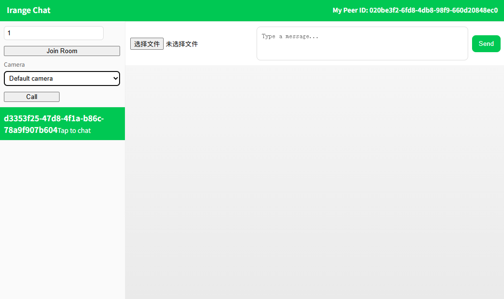

# Irange Chat - Peer-to-Peer Chat Application

A modern, browser-based peer-to-peer chat application with video calling capabilities, built with PeerJS and Flask. Communicate directly between peers without relying on a central server for message routing.


## 📋 Table of Contents

- [Overview](#overview)
- [Features](#features)
- [Architecture](#architecture)
- [Prerequisites](#prerequisites)
- [Installation](#installation)
- [Usage](#usage)
- [API Reference](#api-reference)
- [Troubleshooting](#troubleshooting)
- [Security Notes](#security-notes)
- [Project Structure](#project-structure)
- [Contributing](#contributing)
- [License](#license)

## 🎯 Overview

Irange Chat enables direct peer-to-peer communication between users in the same room. The application uses WebRTC technology (via PeerJS) to establish direct connections between peers, allowing for:


- **Text messaging** - Real-time chat between peers
- **File sharing** - Transfer files and images directly between users
- **Video calls** - One-to-one video communication with camera selection
- **Room-based discovery** - Simple room system to find and connect with other peers

The Flask server acts only as a lightweight signaling server for peer discovery, while all actual communication happens directly between peers.

## ✨ Features

### Core Functionality
- ✅ **Real-time Text Chat** - Instant messaging between peers
- ✅ **File & Image Transfer** - Share files and images directly via P2P connections
- ✅ **Video Calling** - One-to-one video calls with audio
- ✅ **Camera Selection** - Choose from available cameras before making calls
- ✅ **Room System** - Join rooms to discover and connect with other peers
- ✅ **Contact List** - View all peers in your current room
- ✅ **Message History** - Chat history maintained per peer connection
- ✅ **Responsive UI** - Clean, modern interface inspired by messaging apps

### Technical Features
- **WebRTC-based** - Direct peer-to-peer connections using PeerJS
- **HTTPS Support** - Secure context required for media access
- **STUN Servers** - NAT traversal using Google's STUN servers
- **Cross-browser** - Works on Chrome, Edge, Firefox (Safari with limitations)

## 🏗️ Architecture

```
┌─────────────┐         ┌─────────────┐
│   Peer A    │◄───────►│   Peer B    │
│  (Browser)  │  P2P    │  (Browser)  │
└─────────────┘         └─────────────┘
       │                       │
       │  Signaling            │
       │  (Room Discovery)     │
       └───────────┬───────────┘
                   │
            ┌──────▼──────┐
            │ Flask Server │
            │ (Signaling)  │
            └─────────────┘
```

- **Flask Server**: Handles room registration and peer discovery only
- **PeerJS**: Manages WebRTC connections and signaling
- **Direct P2P**: All messages, files, and video streams flow directly between peers

## 📦 Prerequisites

- **Python 3.7+** - [Download Python](https://www.python.org/downloads/)
- **Modern Web Browser** - Chrome, Edge, or Firefox recommended
- **Network Access** - Internet connection for STUN servers and PeerJS signaling
- **HTTPS Context** - Required for camera/microphone access (handled by Flask's adhoc SSL)

## 🚀 Installation

### Step 1: Clone or Download

```bash
# If using git
git clone <repository-url>
cd p2p

# Or download and extract the project files
```

### Step 2: Create Virtual Environment (Recommended)

**Windows:**
```bash
python -m venv .venv
.venv\Scripts\activate
```

**macOS/Linux:**
```bash
python3 -m venv .venv
source .venv/bin/activate
```

### Step 3: Install Dependencies

```bash
pip install flask
```

That's it! The application uses PeerJS from a CDN, so no additional JavaScript dependencies are needed.

## 💻 Usage

### Starting the Server

From the project root directory:

```bash
python central_host.py
```

The server will start with:
- **URL**: `https://0.0.0.0:7890`
- **Local Access**: `https://localhost:7890`
- **HTTPS**: Self-signed certificate (adhoc SSL)

**Note**: Your browser will show a security warning for the self-signed certificate. Click "Advanced" → "Proceed to localhost" (or similar) to continue. This is normal for development.

### Using the Application

1. **Open the Application**
   - Navigate to `https://localhost:7890` in your browser
   - Accept the security warning for the self-signed certificate
   - Your unique PeerJS ID will be displayed in the header

2. **Join a Room**
   - Enter a Room ID (e.g., "room1", "test", "meeting")
   - Click "Join Room"
   - The server registers your peer ID with the room

3. **Connect with Peers**
   - Other users joining the same room will appear in the contacts list
   - Click on a contact to open a chat window
   - Messages are sent directly to the selected peer

4. **Send Messages**
   - Type your message in the input field
   - Click "Send" or press Enter
   - Messages appear in real-time in the chat log

5. **Share Files**
   - Click the file attachment button (📎)
   - Select a file or image
   - The file is sent directly to the peer via P2P connection

6. **Make Video Calls**
   - Select a camera from the dropdown (if multiple available)
   - Click "Call" to initiate a video call
   - The remote peer will see an incoming call notification
   - Click "Answer" to accept the call
   - Click "Hang Up" to end the call

### Multiple Users

To test with multiple users:
- Open the application in multiple browser tabs/windows
- Join the same Room ID in each
- Each instance will see the others in the contacts list
- Start chatting or calling between instances

## 📡 API Reference

### Flask Endpoints

#### `GET /`
Serves the main application page (`templates/peers.html`).

#### `POST /join`
Registers a peer with a room.

**Request:**
```
Content-Type: application/x-www-form-urlencoded

roomId: string
peerId: string
```

**Response:**
```
Joined room: <roomId>
```

#### `POST /get_peers`
Retrieves all peer IDs in a room.

**Request:**
```
Content-Type: application/x-www-form-urlencoded

roomId: string
```

**Response:**
```json
{
  "peers": ["peer-id-1", "peer-id-2", ...]
}
```

### PeerJS Configuration

The application uses the following PeerJS configuration:

```javascript
{
  secure: true,
  debug: 2,
  config: {
    iceServers: [
      { urls: 'stun:stun.l.google.com:19302' },
      { urls: 'stun:stun1.l.google.com:19302' }
    ]
  }
}
```

To add TURN servers for better NAT traversal, modify `static/app.js`:

```javascript
iceServers: [
  { urls: 'stun:stun.l.google.com:19302' },
  { urls: 'stun:stun1.l.google.com:19302' },
  { 
    urls: 'turn:your-turn-server.com:3478',
    username: 'your-username',
    credential: 'your-password'
  }
]
```

## 🔧 Troubleshooting

### Browser Security Warning

**Problem**: Browser shows "Your connection is not private" warning.

**Solution**: This is expected with self-signed certificates. Click "Advanced" → "Proceed to localhost" (Chrome) or "Advanced" → "Accept the Risk and Continue" (Firefox).

### Camera/Microphone Not Working

**Problem**: Browser blocks camera/microphone access.

**Solutions**:
- Ensure you're using HTTPS (the app provides this automatically)
- Check browser permissions: Settings → Privacy → Camera/Microphone
- Grant permissions when prompted by the browser
- Some browsers require user interaction before accessing media

### Peers Cannot Connect

**Problem**: Peers in the same room cannot see each other or connect.

**Solutions**:
- Verify both peers joined the same Room ID (case-sensitive)
- Check browser console for PeerJS errors
- Ensure firewall isn't blocking WebRTC traffic
- Try adding TURN servers if behind strict NATs
- Refresh the page and rejoin the room

### File Downloads Not Working

**Problem**: Files cannot be downloaded or opened.

**Solutions**:
- Some browsers restrict downloads from blob URLs
- Try right-clicking the file link and "Save As"
- Check browser download settings
- For images, click to open in a new tab, then save

### Safari-Specific Issues

**Problem**: Features don't work properly in Safari.

**Solutions**:
- Safari has limited WebRTC support
- Use Chrome, Edge, or Firefox for best compatibility
- Ensure `playsinline` attribute is present (already included)
- User gestures may be required for autoplay

### Video Call Issues

**Problem**: Video calls don't connect or show black screen.

**Solutions**:
- Check camera permissions
- Try selecting a different camera from the dropdown
- Ensure both peers have granted camera access
- Check browser console for WebRTC errors
- Verify network connectivity (STUN/TURN servers accessible)

## 🔒 Security Notes

### Development vs Production

⚠️ **This application is designed for educational purposes and local development.**

**Current Security Considerations:**
- Self-signed SSL certificate (browser warnings expected)
- No authentication or authorization
- No input validation on server endpoints
- Room IDs and peer IDs are not secured
- No rate limiting or abuse prevention

**For Production Use:**
- Use a valid SSL certificate (Let's Encrypt, commercial CA)
- Implement user authentication
- Add input validation and sanitization
- Implement rate limiting
- Add CSRF protection
- Use secure session management
- Consider adding message encryption
- Implement proper logging and monitoring

### Network Security

- All P2P connections use WebRTC encryption
- Signaling goes through the Flask server (consider securing this)
- STUN servers are public (Google's servers)
- TURN servers (if added) should be secured with credentials

## 📁 Project Structure

```
p2p/
├── central_host.py          # Flask server (signaling & room registry)
├── templates/
│   └── peers.html           # Main HTML UI
├── static/
│   ├── app.js               # PeerJS client logic & UI handlers
│   ├── peer.js              # (if custom PeerJS build)
│   ├── peerjs.min.js        # (if local PeerJS build)
│   └── style.css            # Application styles
├── scripts/                 # (utility scripts if any)
└── readme.md                # This file
```

### Key Files

- **`central_host.py`**: Minimal Flask server handling room registration and peer discovery
- **`templates/peers.html`**: Main UI template with chat interface and video overlay
- **`static/app.js`**: Core application logic including PeerJS setup, message handling, and video call management
- **`static/style.css`**: Styling for the chat interface

## 🤝 Contributing

Contributions are welcome! Here are some ways you can help:

1. **Report Bugs**: Open an issue with detailed reproduction steps
2. **Suggest Features**: Share ideas for new functionality
3. **Submit Pull Requests**: Fix bugs or add features
4. **Improve Documentation**: Enhance this README or add code comments

### Development Setup

1. Fork the repository
2. Create a feature branch: `git checkout -b feature/amazing-feature`
3. Make your changes
4. Test thoroughly
5. Commit: `git commit -m 'Add amazing feature'`
6. Push: `git push origin feature/amazing-feature`
7. Open a Pull Request

## 📄 License

This project is licensed under the MIT License - see the LICENSE file for details.

You are free to:
- Use the code commercially
- Modify the code
- Distribute the code
- Use it privately

## 🙏 Acknowledgments

- [PeerJS](https://peerjs.com/) - WebRTC peer-to-peer data, video, and audio calls
- [Flask](https://flask.palletsprojects.com/) - Lightweight Python web framework
- Google STUN servers for NAT traversal

---

**Made with ❤️ for peer-to-peer communication**

For questions or issues, please open an issue on the repository.
